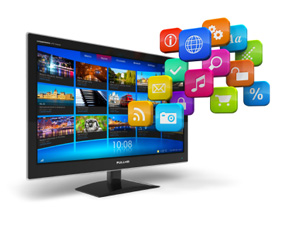

# Practica01-Mi-Blog
A.	Desarrollo de los puntos:
Como punto inicial tenemos una carpeta en donde tendremos la página principal index.html, además de que tendremos las carpetas con las demás paginas html y una carpeta adicional para las imágenes.
 

Index.html:

En la página principal index.html tenemos:
<!DOCTYPE html>
<html>
<head>
   <title>Televisión Digital</title>
   <meta charset="utf-8" />
   <meta name="viewport" content="width=device-width, initial-scale=1" />
   <link href="ct_base.css" rel="stylesheet" />
   <link href="ct_layout1.css" rel="stylesheet" />
</head>

<body>
   <header>
   
      
	
   </header>
   <nav>
   
      <a href ="1/television.html">
	  
Concepto

      <a href ="2/formatos.html">
	  
 Formatos

      <a href ="3/tecnologia.html">
	   
	  
Tecnologias

      <a href ="4/implementacion.html">
	   
	  
Implementación

      <a href ="5/ventajas.html">
	   
	  
Ventajas

	  
   </nav>
  
	
	
   <footer>
   
      Luis Fernando Deleg Aguilar
	 
	
Email: <a href="mailto:luisfer_96@hotmail.es">luisfer_96@hotmail.es</a>

	
	
Teléfono: <a href="tel:0989851097">0989851097</a>

	

	&copy; Todos los derechos reservados.
	

   </footer>

   
</body>
</html>

Como se pide en la práctica tenemos la creación del header que tiene un menú para poder navegar entre las diferentes paginas que se van a crear. Como tema elegido fue acerca de la televisión digital es por ello que en nuestro menú tenemos 5 temas relacionados con el mismo (Televisión digital, formatos, tecnología, implementación y ventajas).
Las etiquetas que se usan son:
Img src: se usa para buscar las imágenes, nosotros indicamos la ruta en donde está la imagen.
Nav: sirve para hacer la navegación.
A href: sirve para hacer referencia a la pagina que nosotros deseamos y conjuntamente con la búsqueda de imágenes para que cuando se haga click se dirija a la página escogida.
Br/: sirve para hacer un salto de línea.
Footer: sirve para que se haga el pie de página.

: sirve para poner el texto que se desea
mailto: es la etiqueta que ayuda a diferenciar sobre un correo electronico
@copy: sirve para poner el símbolo de copyright

Muestra de la página:

 
Televisión.html

Para la página televisión.html tenemos el siguiente código:
<!doctype html>
<html>
<head>
<!--
    New Perspectives on HTML5 and CSS3, 7th Edition
    Tutorial 1
    Tutorial Case
    
    Curbside Thai Reviews Page
    Author: 
    Date:   

    Filename: ct_reviews.html
   -->

   <meta charset="utf-8" />
   <title>Televisión Digital</title>
   <link href="ct_base.css" rel="stylesheet" />
   <link href="ct_layout2.css" rel="stylesheet" />
</head>

<body>
  <header class="logo">
     
	 
	 <nav>
		<ul>
			<li><a href="../index.html">Inicio</a></li>
			<li><a href="../2/formatos.html">Formatos</a></li>
			<li><a href="../3/tecnologia.html">Tecnología</a></li>
			<li><a href="../4/implementacion.html">Implementación</a></li>
			<li><a href="../5/ventajas.html">Ventajas</a></li>
			
		</ul>
	 
  </header>
  
 MENU:

  
<a href=#Definicion>La televisión digital</a>

  
Tipos de television digital

  
<a href=#abierta>Abierta</a>

  
<a href=#cable>Por Cable</a>

  
<a href=#ip>IPTV</a>

  <section>
	<article>
     
		
		
<b><h1><a name=Definicion>La televisión digital</a></h1></b> Es uno de los más     grandes cambios
		que se puede afrontar ya que muchos de nosotros no estamos
		muy bien informados o conocemos del tema, pero al ser
		una gran innovación trae consigo grandes beneficios ya que
		si optamos por esta tecnología se puede esperar a un gran
		cambio en el futuro ya que esto nos brindaría otros servicios
		como los es <kbd>la recepción móvil de televisión, servicios
		multimedia, interactividad. </kbd> Además de que hoy en día las
		estaciones transmisoras están en aumento y se necesita algo
		que cubra todas estas transmisiones. 

	</article>
		

			<i> Es el conjunto de tecnologías de transmisión y recepción
			de sonido e imagen a través de señales digitales, la gran diferencia
			con las televisiones analógicas es que estas codifican
			señales de forma binaria. </i>
		

	
	</section>
	
	<section>
		
Tipos de television digital:

		
<h1><a name=abierta>Abierta:</a></h1>

		Esta se puede emitir desde frecuencias de 700Hz
		que puede ser captado libremente por televisores compatibles
		con tv digital o que tengan un decodificador especializado. 

		
		
<h1><a name=cable>Por Cable:</a></h1>
 
		
Es igual que la televisión por cable con la
		diferencia de que la señal que se transmite por el cable
		coaxial es de tipo digital. 

		
		
<h1><a name=ip>IPTV:</a><h1>

		
En este tipo de tv se permite la transmisión a través
			de una conexión de internet además de que proporciona una
			mejor definición de canales y muchos más canales gracias a
			su ancho de banda. 

	</section>
	
	<footer>
	 
	&copy; Todos los derechos reservados.
   </footer>
  
   
</body>

</html>
Las etiquetas que se usan son:
En el cuerpo (body) de la pagina tenemos al logo y además la lista de navegación para dirigirse a las diferentes páginas.
<nav>:sirve oara hacer la navegación
También tenemos un menú para navegar por los diferentes títulos de la página es decir hipertexto.
Se tiene dos secciones con la etiqueta <section> en donde se escogió los títulos para poder hacer el hipertexto.
Muestra de la página:
  
 

Formatos.html

<!doctype html>
<html>
<head>
<!--
    New Perspectives on HTML5 and CSS3, 7th Edition
    Tutorial 1
    Tutorial Case
    
    Curbside Thai Reviews Page
    Author: 
    Date:   

    Filename: ct_reviews.html
   -->

   <meta charset="utf-8" />
   <title>Formatos</title>
   <link href="ct_base.css" rel="stylesheet" />
   <link href="ct_layout2.css" rel="stylesheet" />
   
</head>

<body>
  <header class="logo">
     
FORMATOS DE LA TELEVISION DIGITAL

	 
	 <nav>
		<ul>
			<li><a href="../index.html">Inicio</a></li>
			<li><a href="../1/television.html">Televisión</a></li>
			<li><a href="../3/tecnologia.html">Tecnología</a></li>
			<li><a href="../4/implementacion.html">Implementación</a></li>
			<li><a href="../5/ventajas.html">Ventajas</a></li>
			
		</ul>
	 
  </header>
  <article>
     
	
La televisión digital puede transmitir a diferentes resoluciones
		por lo que permite crear sub-canales de transmisión,
		los formatos pueden ser:

		
	
	
		

			<table border="1px">
				<thead>
					<tr>
						<td>Formato</td>
						<td>Exploración</td>
						<td>Pixeles</td>
					</tr>
				</thead>
				
				<tbody>
					<tr>
						<td>480i</td>
						<td>Entrelazada</td>
						<td>720x480</td>
					</tr>
					<tr>
						<td>480p</td>
						<td>Progresiva</td>
						<td>720x480</td>
					</tr>
					<tr>
						<td>576i</td>
						<td>Entrelazada</td>
						<td>720x576</td>
					</tr>
					<tr>
						<td>576p</td>
						<td>Progresiva</td>
						<td>720x576</td>
					</tr>
					<tr>
						<td>720p</td>
						<td>Progresiva</td>
						<td>1280x720</td>
					</tr>
					<tr>
						<td>1080i</td>
						<td>Entrelazada</td>
						<td>1920x1080</td>
					</tr>
					<tr>
						<td>1080p</td>
						<td>Progresiva</td>
						<td>1920x1080</td>
					</tr>
				</tbody>
			</table>
		

	
	
  </article>
  
  
  <footer>
   
	&copy; Todos los derechos reservados.
   </footer>
</body>

</html>

En esta pagina vamos a crear una tabla para ello creamos la tabla con la etiqueta:
<td>
         <tr>: sirve para ir creando una tabla por partes es decir se la va creando por filas 

Muestra de la página:

 

Tecnología.html
<!doctype html>
<html>
<head>
<!--
    New Perspectives on HTML5 and CSS3, 7th Edition
    Tutorial 1
    Tutorial Case
    
    Curbside Thai Reviews Page
    Author: 
    Date:   

    Filename: ct_reviews.html
   -->

   <meta charset="utf-8" />
   <title>Tecnología</title>
   <link href="ct_base.css" rel="stylesheet" />
   <link href="ct_layout2.css" rel="stylesheet" />
</head>

<body>
  <header class="logo">
     
	 <nav>
		<ul>
			<li><a href="../index.html">Inicio</a></li>
			<li><a href="../1/television.html">Televisión</a></li>
			<li><a href="../2/formatos.html">Formatos</a></li>
			<li><a href="../4/implementacion.html">Implementación</a></li>
			<li><a href="../5/ventajas.html">Ventajas</a></li>
			
		</ul>
	 
  </header>
  <article>
    
	
La tecnología que se necesita para poder implementar la
		televisión digital en el ecuador es que se necesita tener un
		televisor digital o sino un televisor analógico pero que cuente
		con un decodificador, además de tener una antena interior
		apta para poder recibir señales digitales o en el peor de los
		casos tener una antena exterior, por último, se necesitaría
		hacer un barrido de sintonización para encontrar todos los
		canales digitales disponibles.

	
	<a> Acontinuación se muestra un video explicativo de como funciona y que tecnologias
		se necesita para poder tener una television digital.</a>
		

		<iframe width="560" height="315" src="https://www.youtube.com/embed/muGzyRVd7bI" 
		frameborder="0" allow="accelerometer; autoplay; encrypted-media; gyroscope; picture-in-picture" allowfullscreen></iframe>
		

		  
  </article>
  
   <footer>
   
	&copy; Todos los derechos reservados.
   </footer>
</body>

</html>

En esta página vamos a crear, además del menú se crea un enlace hacia un video que se encuentra en youtube con la etiqueta iframe.
Muestra de la página:
 
Implementación.html
<!doctype html>
<html>
<head>
<!--
    New Perspectives on HTML5 and CSS3, 7th Edition
    Tutorial 1
    Tutorial Case
    
    Curbside Thai Reviews Page
    Author: 
    Date:   

    Filename: ct_reviews.html
   -->

   <meta charset="utf-8" />
   <title>Implementación</title>
   <link href="ct_base.css" rel="stylesheet" />
   <link href="ct_layout2.css" rel="stylesheet" />
</head>

<body>
  <header class="logo">
  

     
	

	 <nav>
		<ul>
			<li><a href="../index.html">Inicio</a></li>
			<li><a href="../1/television.html">Televisión</a></li>
			<li><a href="../2/formatos.html">Formatos</a></li>
			<li><a href="../3/tecnologia.html">Tecnología</a></li>
			<li><a href="../5/ventajas.html">Ventajas</a></li>
			
		</ul>
	 
  </header>
  <article>
	<blockquote>
		
La implementación de la televisión digital en el ecuador
		está prevista que en Quito se tenga un cambio total en mayo
		del 2020 y en Guayaquil en julio de 2020.

	</blockquote>
	
	<blockquote>
		
Se establece que para el 2023 todo el país cuente con
		televisión digital. A comparacion de nuestro pais, en España
		esta tecnologia ya fue implementada apartir del 3 de abril de
		2010.

	</blockquote>
  </article>
  <footer>
	 
	&copy; Todos los derechos reservados.
   </footer>

</body>

</html>

En esta página tenemos la utilización de la etiqueta blockquote que sirve para hacer citas o referencias que han dicho otras personas al no tener la información de las personas no se pudo poner el autor.

Muestra de la página:
 
Ventajas.html
<!doctype html>
<html>
<head>    
   <meta charset="utf-8" />
   <title>Ventajas</title>
   <link href="ct_base.css" rel="stylesheet" />
   <link href="ct_layout2.css" rel="stylesheet" />
</head>

<body>
  <header>
	<!---->
     
	 <nav>
		<ul>
			<li><a href="../index.html">Inicio</a></li>
			<li><a href="../1/television.html">Televisión</a></li>
			<li><a href="../2/formatos.html">Formatos</a></li>
			<li><a href="../3/tecnologia.html">Tecnología</a></li>
			<li><a href="../4/implementacion.html">Implementación</a></li>
		</ul>
	 </nav>
	 
  </header>
  <article>
     
	
A continuación, se establece algunas de las ventajas que
		tiene la televisión digital frente a la televisión analógica:

		<ul>
			<li> Se tiene una mejor calidad en imagen y sonido.</li>
			<li> Mayor número de canales.</li>
			<li> Servicios interactivos.</li>
			<li> Recepción portátil y en movimiento.</li>
		</ul>
  </article>
<footer>
	 
	&copy; Todos los derechos reservados.
   </footer>
</body>

</html>
Como se pide en la practica se fue desarrollando cada punto que se pedía, en esta ultima se creo una lista con la etiqueta <ul> y <li> para poder generar la lista, en este caso fue una pequeña lista de las ventajas de la televisión digital.
